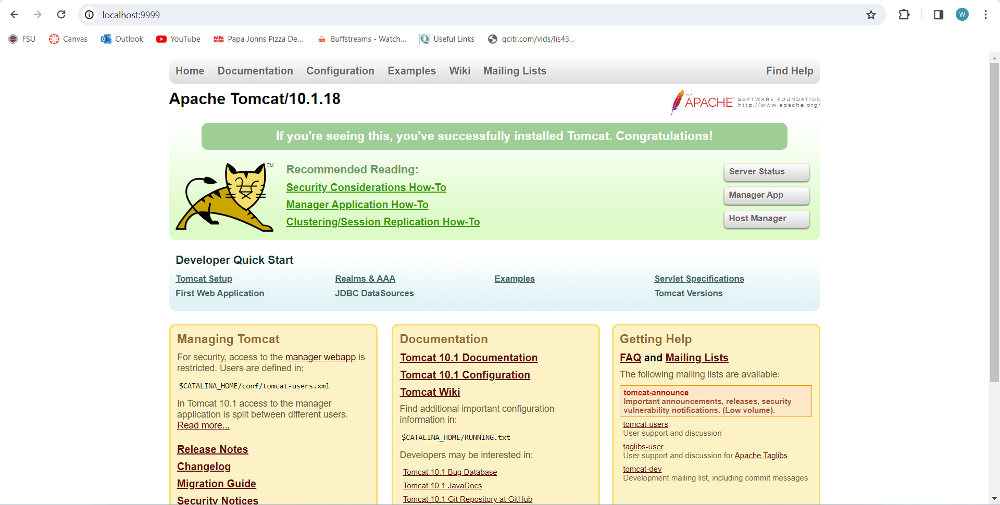

> **NOTE:** This README.md file should be placed at the **root of each of your repos directories.**
>
>Also, this file **must** use Markdown syntax, and provide project documentation as per below--otherwise, points **will** be deducted.
>

# LIS4368

## Ryan Parks

### Assignment #1 Requirements:

*Three Parts:*

1. Distributed Version Control with Git and BitBucket
2. Java/JSP/Servlet Development Installation
3. Chapter Questions (Chs 1 - 4)

#### README.md file should include the following items:

* Screenshot of running java Hello (#1 above);
* Screenshot of running http://localhost:9999 (#2 above, Step #4(b) in tutorial);
* git commands w/short descriptions;
* Bitbucket repo links: a) this assignment and b) the completed tutorial above (bitbucketstationlocations).

> This is a blockquote.
> 
> This is the second paragraph in the blockquote.
>
> #### Git commands w/short descriptions:

1. git init - creates a new git repository
2. git status - displays the state of the current working directory
3. git add - adds a change from the working directory to the staging area
4. git commit - creates a "snapshot" of the project's current changes, allows for a message using -m
5. git push - uploads local repository files or changes to remote repository online
6. git pull - fetches and downloads content from a remote repository to your local repository
7. git remote -v - checks the connection to your remote repository and displays it back to you

#### Assignment Screenshots:

*Screenshot of AMPPS running http://localhost*:

*Screenshot of running java Hello*:

*Screenshot of Assignment 1 Page*:

#### Tutorial Links:

*Bitbucket Tutorial - Station Locations:*
[A1 Bitbucket Station Locations Tutorial Link](https://bitbucket.org/rmp21gfsu/bitbucketstationlocations/ "Bitbucket Station Locations")