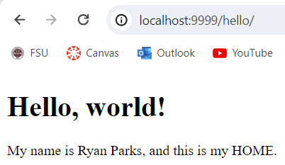
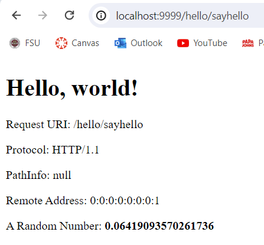
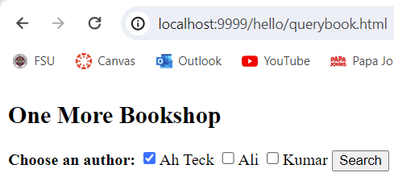
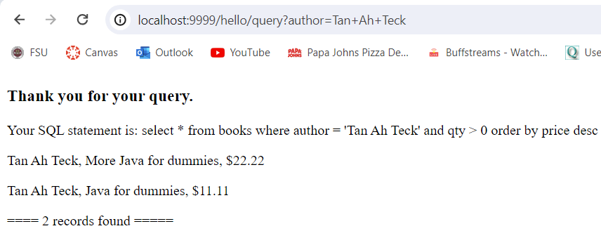
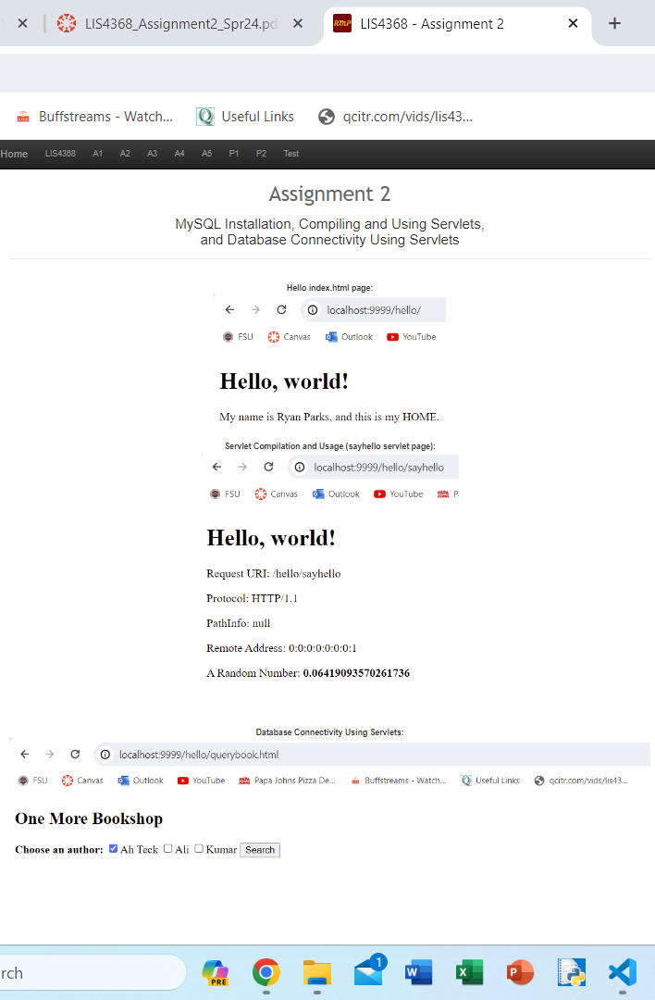

> **NOTE:** This README.md file should be placed at the **root of each of your repos directories.**
>
>Also, this file **must** use Markdown syntax, and provide project documentation as per below--otherwise, points **will** be deducted.
>

# LIS4368

## Ryan Parks

### Assignment #2 Requirements:

1. Screenshots (1) querybook.html, (2) the query results, and (3) a screenshot of your a2/index.jsp file

#### README.md file should include the following items:

* Screenshot of hello page;
* Screenshot of sayhello page with servlet;
* Screenshot of querybook.html page;
* Screenshot of the query results;
* Screenshot of a2/index.jsp;

> This is a blockquote.
> 
> This is the second paragraph in the blockquote.
>

#### Assignment Screenshots:

*http://localhost:9999/hello*:

*Screenshot of hello page*:

*Screenshot of querybook.html page*:

*Screenshot of queryresults.html page*:

*Screenshot of Assignment 2 Page*:

