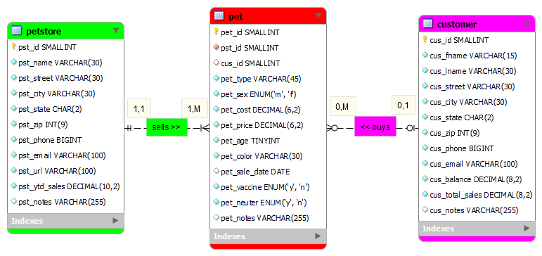
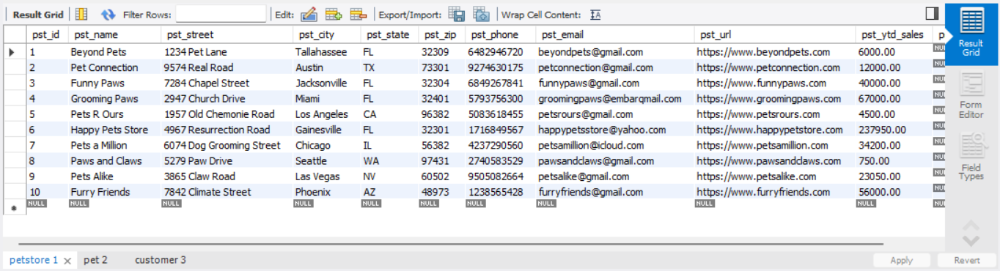
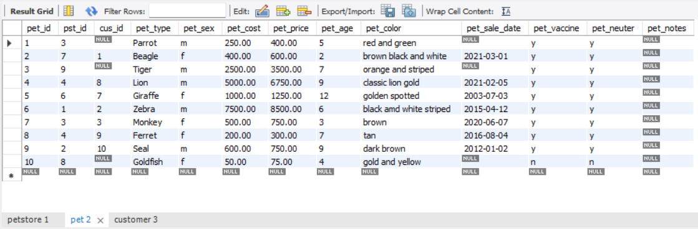
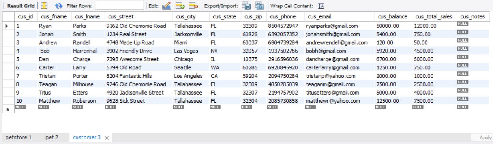
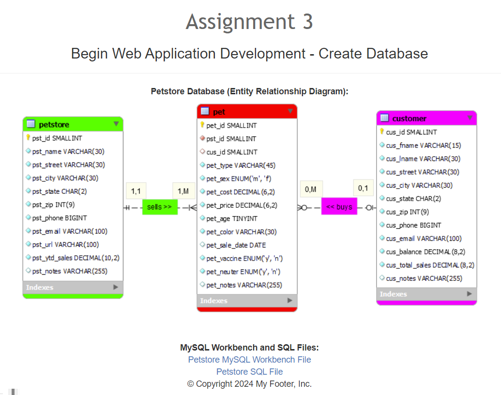
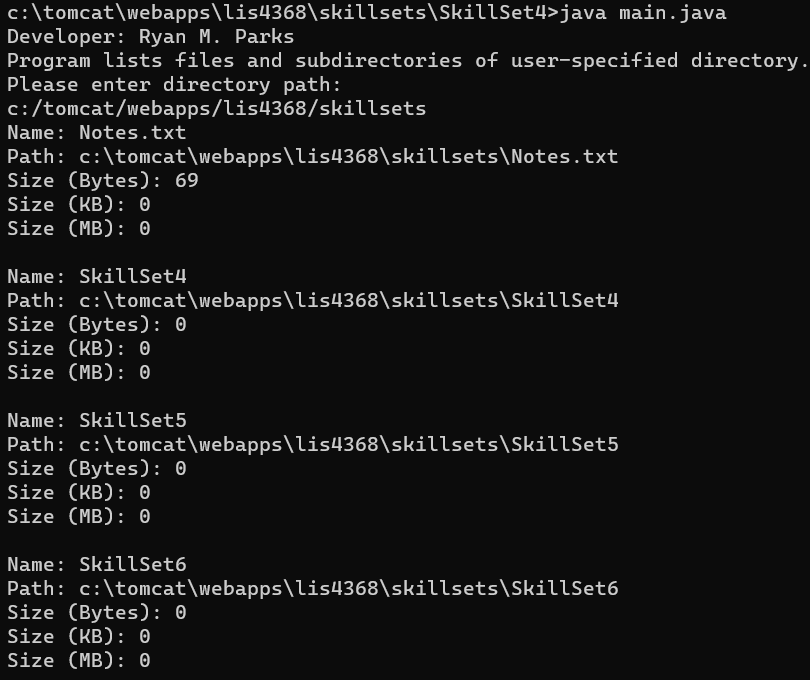
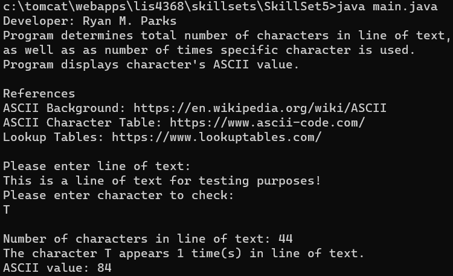
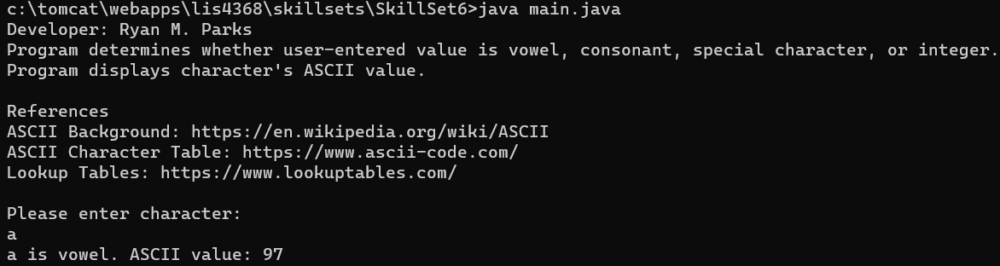

> **NOTE:** This README.md file should be placed at the **root of each of your repos directories.**
>
>Also, this file **must** use Markdown syntax, and provide project documentation as per below--otherwise, points **will** be deducted.
>

# LIS4368

## Ryan Parks

### Assignment #3 Requirements:

1. Screenshot of ERD;
2. Screenshots of 10 records for each table;
3. Screenshot of a3/index.jsp;
4. Links to a3.mwb and a3.sql;
5. Screenshots of skillsets running;

#### README.md file should include the following items:

* Screenshot of ERD;
* Screenshot of 10 records in each table;
* Screenshot of a3/index.jsp page;
* Links to a3.mwb and a3.sql;
* Screenshots of skillsets running;

> This is a blockquote.
> 
> This is the second paragraph in the blockquote.
>

#### Assignment Screenshots:

*Screenshot of ERD*:

*Screenshot of 10 records in each table*:

*Screenshot a3/index.jsp*:

*Links to a3.mwb and a3.sql*:

[A3 MWB File](docs/a3.mwb)
[A3 SQL File](docs/a3.sql)

*Screenshots of Skillsets*:

