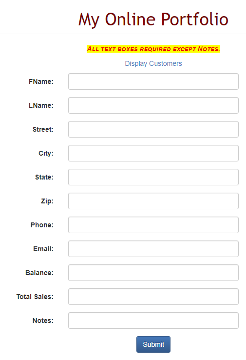
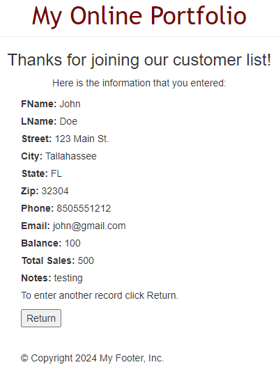
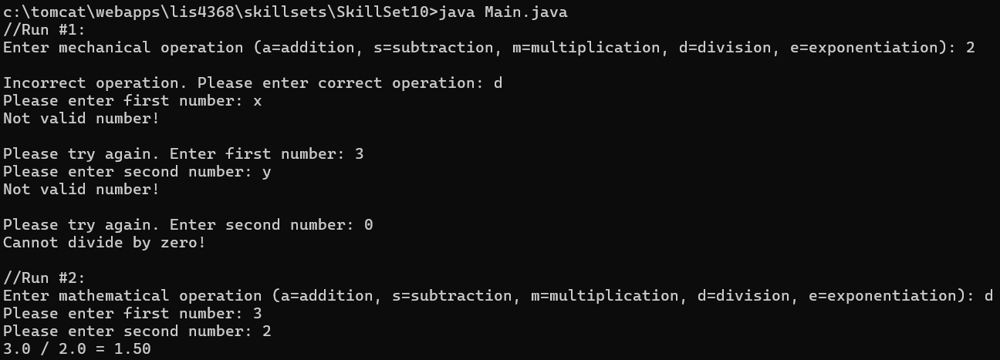
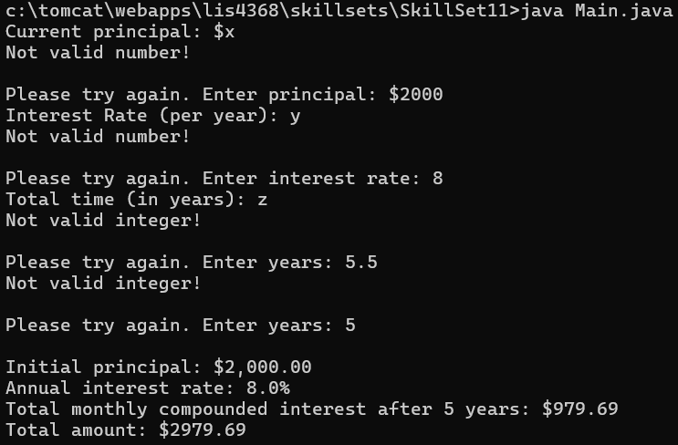
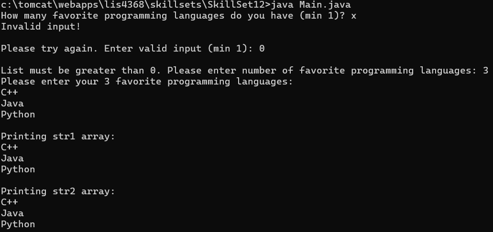

> **NOTE:** This README.md file should be placed at the **root of each of your repos directories.**
>
>Also, this file **must** use Markdown syntax, and provide project documentation as per below--otherwise, points **will** be deducted.
>

# LIS4368

## Ryan Parks

### Assignment #4 Requirements:

1. Screenshot of Failed Validation;
2. Screenshot of Passed Validation;
3. Screenshots of skillsets 10-12;

#### README.md file should include the following items:

* Screenshot of Failed Validation;
* Screenshot of Passed Validation;
* Screenshots of skillsets 10-12;

> This is a blockquote.
> 
> This is the second paragraph in the blockquote.
>

#### Assignment Screenshots:

*Screenshot of Failed Validation*:

*Screenshot of Passed Validation*:

*Screenshots of Skillsets*:

