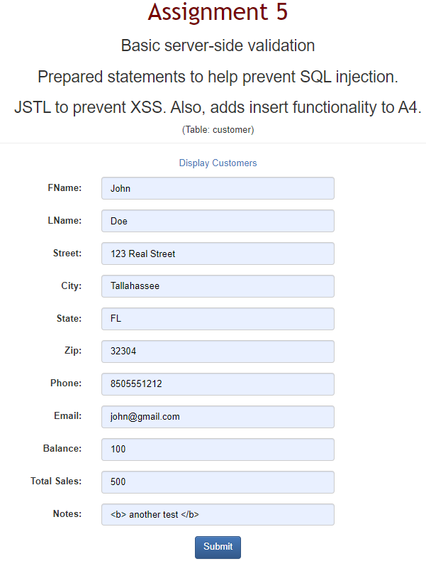
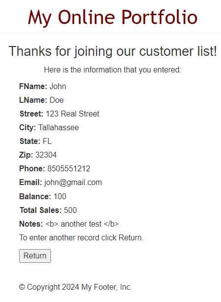
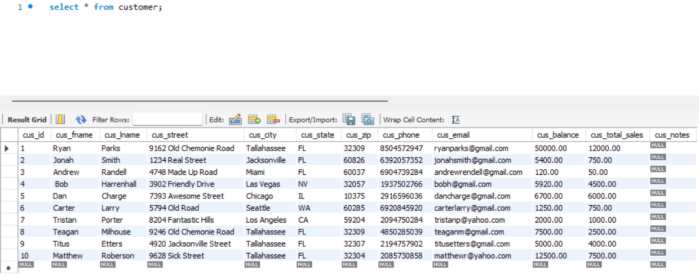
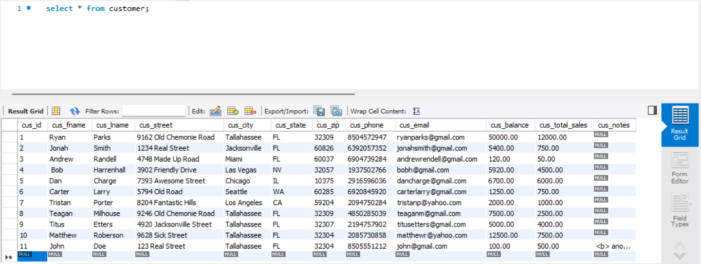
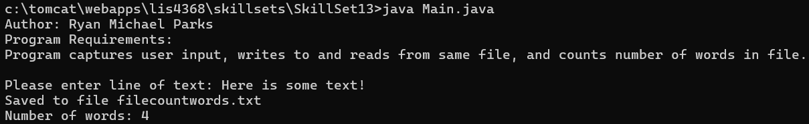
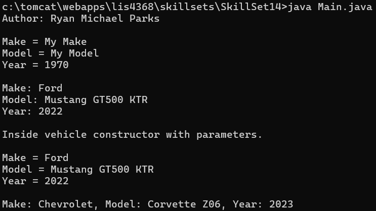
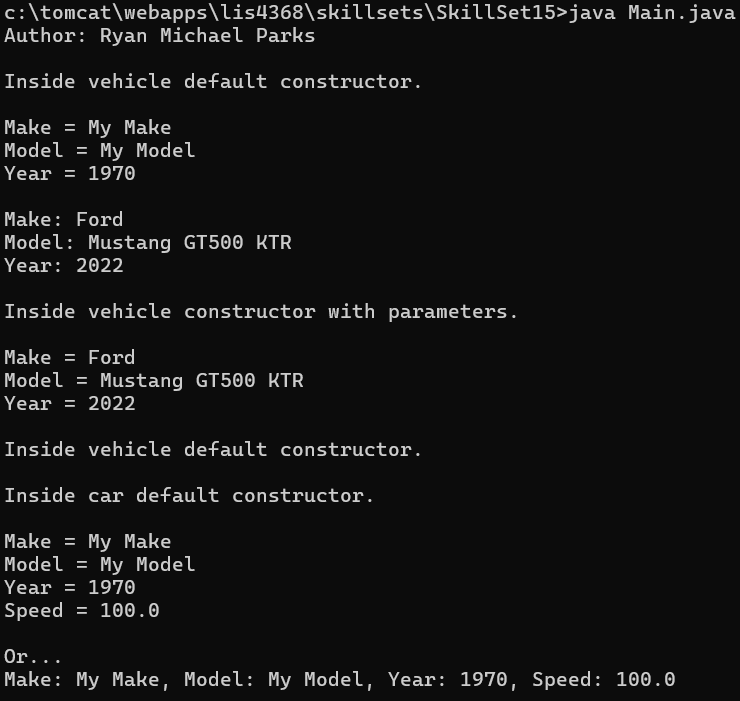
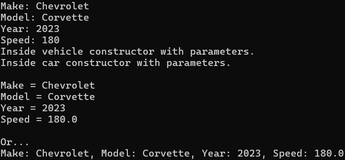

> **NOTE:** This README.md file should be placed at the **root of each of your repos directories.**
>
>Also, this file **must** use Markdown syntax, and provide project documentation as per below--otherwise, points **will** be deducted.
>

# LIS4368

## Ryan Parks

### Assignment #5 Requirements:

1. Screenshot of Valid User Form Entry;
2. Screenshot of Passed Validation;
3. Screenshots of Associated Database Entry;
4. Screenshots of Skillsets 13-15;

#### README.md file should include the following items:

* Screenshot of Valid User Form Entry;
* Screenshot of Passed Validation;
* Screenshots of Associated Database Entry;
* Screenshots of Skillsets 13-15;

> This is a blockquote.
> 
> This is the second paragraph in the blockquote.
>

#### Assignment Screenshots:

*Screenshot of Valid User Form Entry*:

*Screenshot of Passed Validation*:

*Screenshots of Associated Database Entry*:

*Screenshots of Skillsets*:

