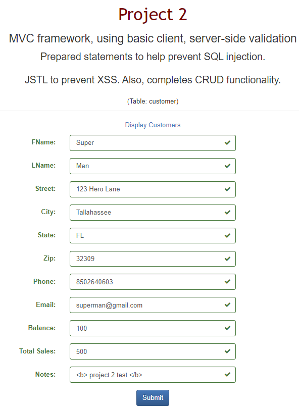
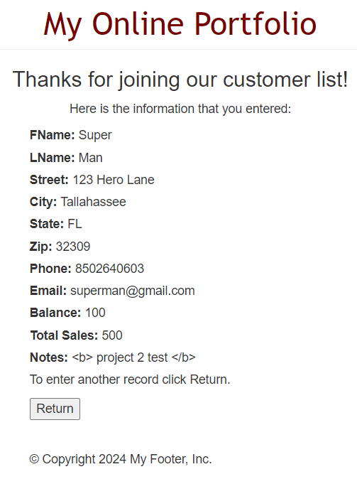
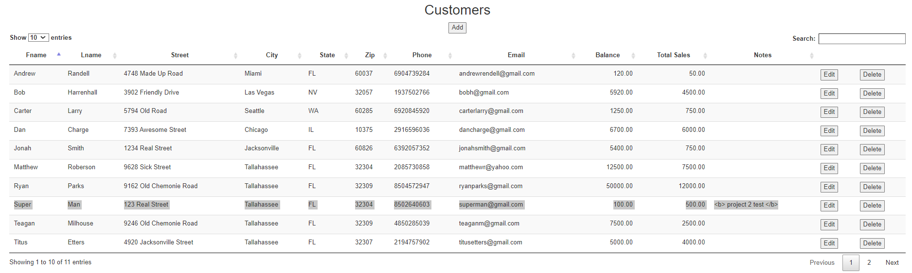
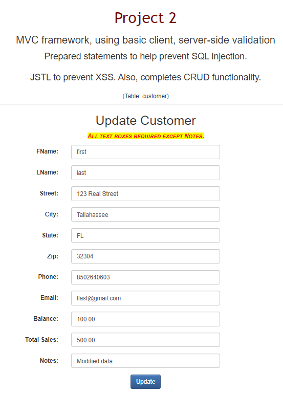
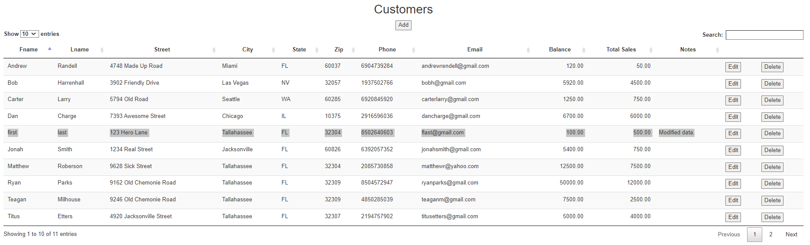
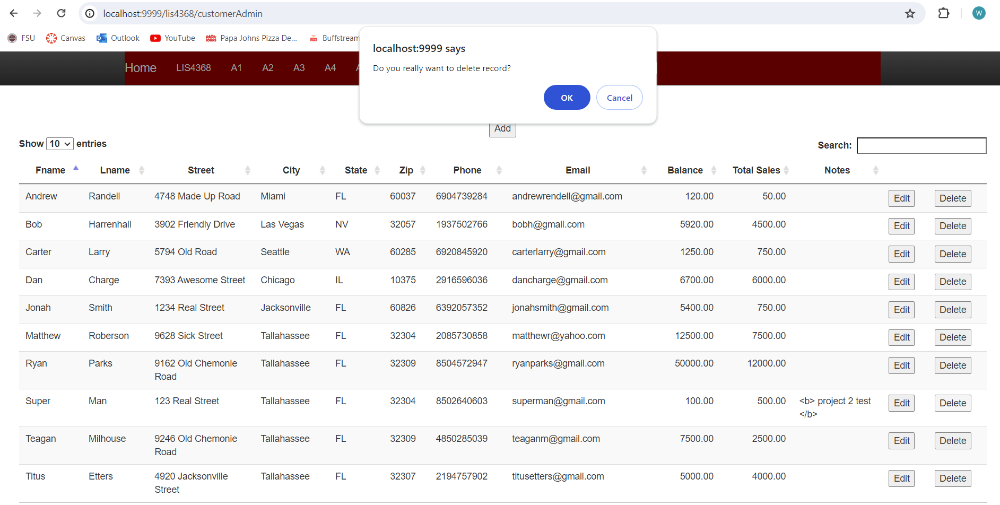
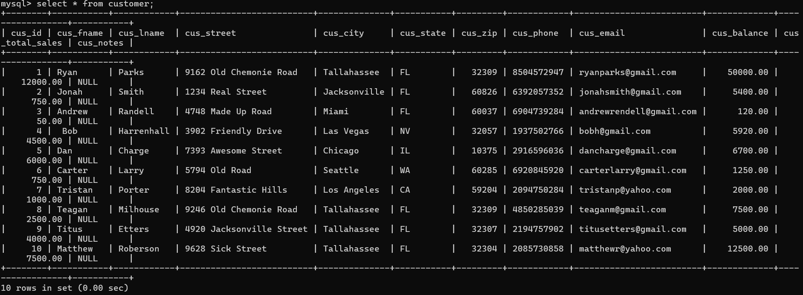
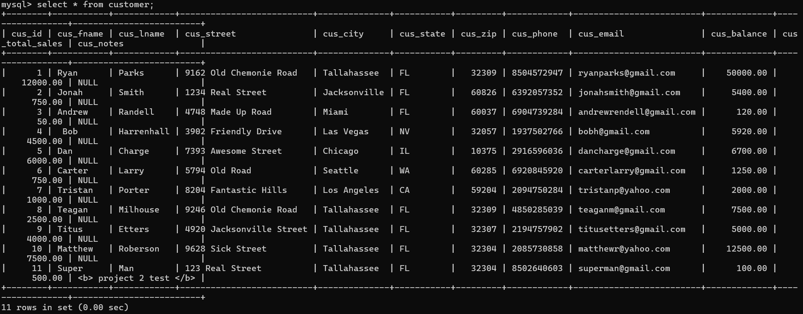
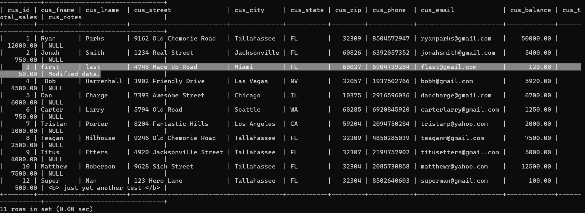
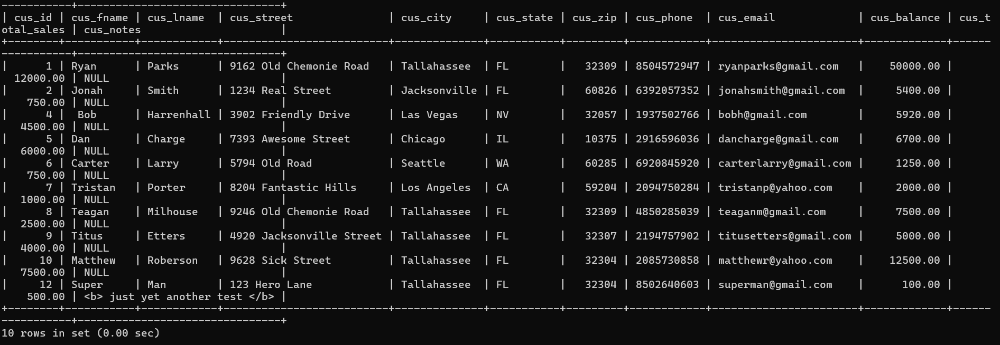

> **NOTE:** This README.md file should be placed at the **root of each of your repos directories.**
>
>Also, this file **must** use Markdown syntax, and provide project documentation as per below--otherwise, points **will** be deducted.
>

# LIS4368

## Ryan Parks

### Project #2 Requirements:

1. Screenshot of Valid User Form Entry;
2. Screenshot of Passed Validation;
3. Screenshot of Displayed Data;
4. Screenshot of Modify Form;
5. Screenshot of Modified Data;
6. Screenshot of Delete Warning;
7. Screenshot of Associated Database Changes (Select, Insert, Update, Delete);

#### README.md file should include the following items:

* Screenshot of Valid User Form Entry;
* Screenshot of Passed Validation;
* Screenshot of Displayed Data;
* Screenshot of Modify Form;
* Screenshot of Modified Data;
* Screenshot of Delete Warning;
* Screenshot of Associated Database Changes (Select, Insert, Update, Delete);

> This is a blockquote.
> 
> This is the second paragraph in the blockquote.
>

#### Project Screenshots:

*Screenshot of Valid User Form Entry*:

*Screenshot of Passed Validation*:

*Screenshot of Displayed Data*:

*Screenshot of Modify Form*:

*Screenshot of Modified Data*:

*Screenshot of Delete Warning*:

*Screenshot of Associated Database Changes*:

